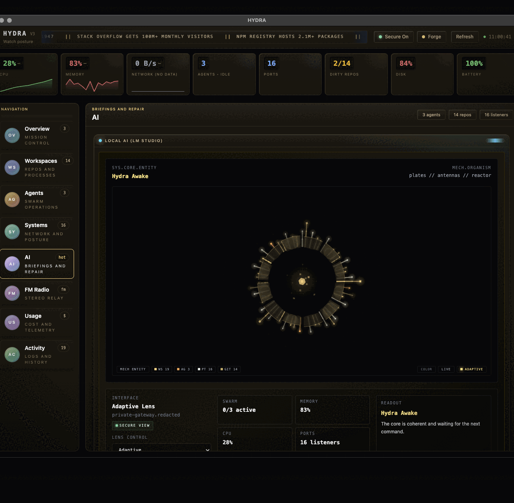
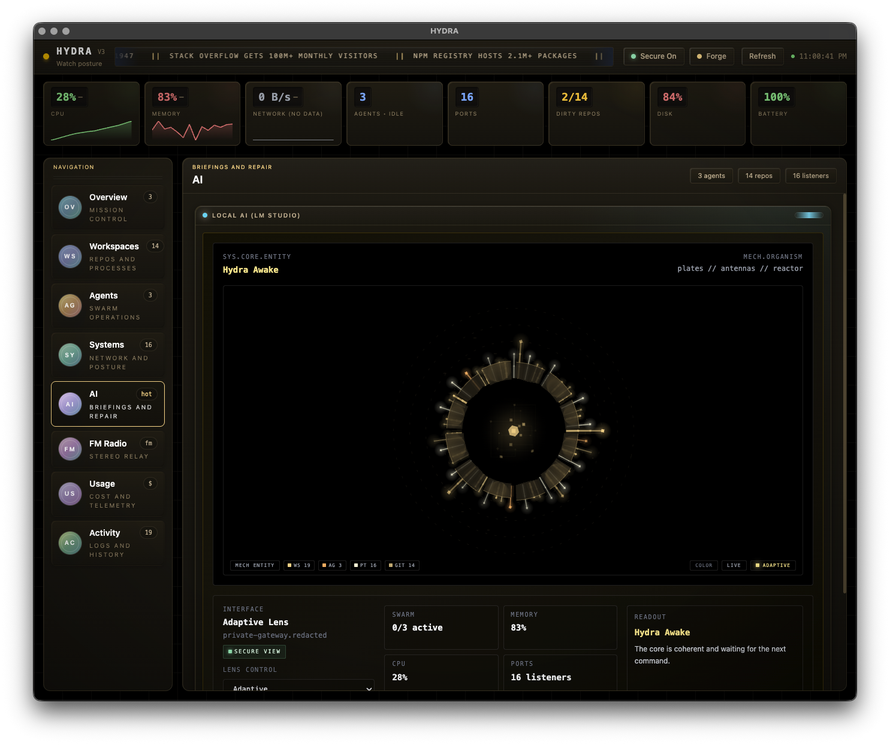
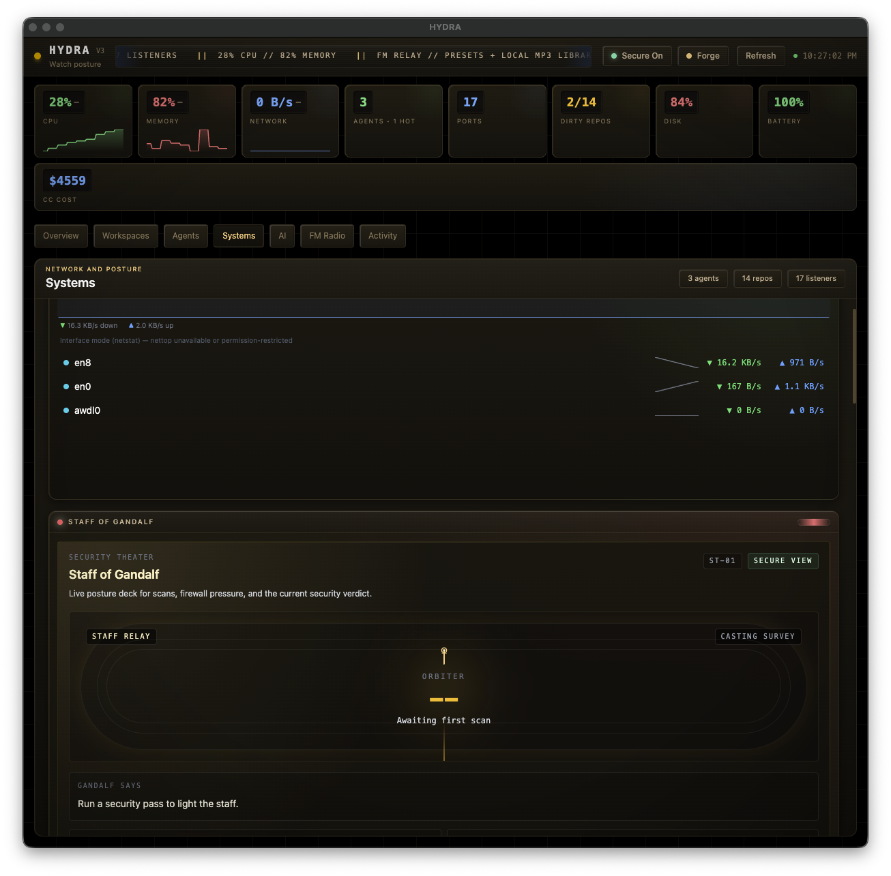

# HELM

**Operator shell for local AI systems.**

HELM is a desktop dashboard for developers running AI agents, local models, and multi-service workflows on their own machines. It monitors processes, agents, git repos, network traffic, and security posture in real time, with an AI intelligence layer that generates briefings and auto-heals common failures.

Think htop crossed with an aircraft carrier CIC, wrapped in a Winamp skin.



## Why

If you run local AI (LM Studio, Ollama, Claude Code sessions), background services, and multiple git repos simultaneously, your machine becomes a distributed system. HELM gives you one place to watch all of it without tabbing between terminal windows, Activity Monitor, and browser tabs.

## What It Does

| Page | Purpose |
|------|---------|
| **Bridge** | Mission control. Health scorecards, process hotspots, compact AI briefing, auto-heal notifications. |
| **Fleet** | Workspace ops. Process groups by project, git status across all repos, commit history with AI-author detection. |
| **Swarm** | Agent ops. Live roster of running AI agents (Claude Code, Codex, Gemini, Cursor, Aider, Copilot), uptime, goals, session timeline. |
| **Grid** | Infrastructure. Per-process network bandwidth, listening ports, Staff of Gandalf security scans with posture scoring. |
| **AI** | Intelligence layer. LM Studio briefings, Yennefer extended briefings, Claude Code usage/spend tracking. |
| **Radio** | FM streaming tuner. Presets, local MP3 import, direct URL loading, signal globe visualization. |
| **Logs** | Raw event stream. Live log tailing from configured file paths. |

Every panel appears on exactly one page. No duplicated widgets.





## Intelligence Layer

HELM includes an AI-powered ops layer that runs on local LM Studio. No cloud inference required for briefings.

- **Operator Briefing** generates a situation report from current system state via Claude Haiku or local models
- **Yennefer** provides extended briefings with configurable personality (adaptive, throughput, creative, strict)
- **Auto-heal engine** monitors 5 rule types (process disappearance, port conflicts, high CPU/memory, agent idle) with 60-second cooldowns to prevent alert fatigue
- **Invoke Repair** probes local, configured, and LAN-discovered LM Studio endpoints and persists the first healthy one it finds

For cross-machine setups, enable LM Studio network serving on the host and make sure the port is reachable through the firewall.

## Skins

Four built-in skins, toggled with `Cmd+Shift+S`:

- **Deck** -- dark gunmetal chrome, cyan accent
- **Orbiter** -- warmer chrome, teal-green accent
- **Forge** -- reactor gold on black, machine warmth
- **Phantom** -- deep violet neon on obsidian

The aesthetic is intentional: hard bevels, brushed metal textures, recessed LED readouts, raised buttons. Winamp-era shell for a modern ops workflow.

## Stack

Electron 35, React 18, TypeScript, Tailwind 4, Zustand, SQLite (better-sqlite3), Vite (electron-vite), Vitest.

~18k lines of TypeScript across 98 source files. 214 tests. All charts are hand-rolled SVG (no charting library). SQLite persistence for snapshots, alerts, briefings, and session history.

## Getting Started

```bash
git clone https://github.com/kunalnano/hydra.git
cd hydra
npm install
npm run dev
```

Requires Node.js 18+.

## Configuration

Config file: `~/.config/helm/config.json`

| Option | Default | What it controls |
|--------|---------|-----------------|
| `lmStudioUrl` | `http://localhost:1234` | LM Studio endpoint for briefings |
| `yenneferStyle` | `adaptive` | Briefing tone: adaptive, throughput, creative, strict |
| `gitRepoPaths` | `[]` | Repos to monitor for git status |
| `monitorInterval` | `2000` | System polling interval (ms) |
| `staffBinPath` | auto-detected | Path to Staff of Gandalf binary |

Local override via `.env` file (see `.env.example`).

## Testing

```bash
npm run typecheck    # Type-check main + renderer
npm test             # 214 tests across 23 suites
```

## Agent Registry

HELM tracks your AI agent fleet in a persistent local registry at `~/.config/helm/agent-registry.json`. This file is personal to your machine and is never committed to the repo.

On first run, the registry starts empty. Add agents manually through the Registry panel, or let HELM auto-detect them from running processes.

## Platform Support

- **macOS**: primary platform, full feature set
- **Windows/Linux**: supported with guarded monitor paths; some integrations (nettop, LuLu firewall) are macOS-only

## Further Reading

- [Operator Walkthrough](docs/OPERATOR-WALKTHROUGH.md)
- [The Journey So Far](docs/wiki/journey-so-far.md)

## License

[PolyForm Noncommercial 1.0.0](LICENSE). Personal, research, hobby, and educational use permitted. Commercial use requires a separate license.
