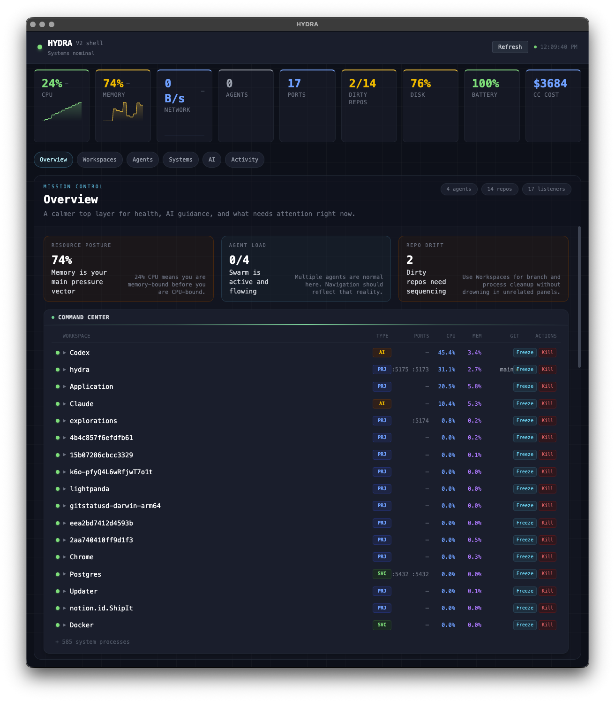
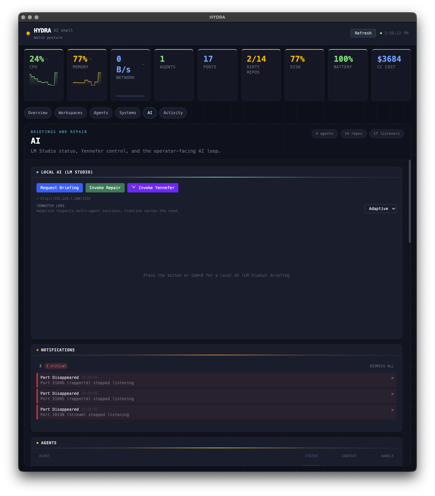

# HYDRA v2 — Operator Shell For Local AI Systems

Hydra is a desktop ops shell for developers running AI agents, local services, and multi-machine model workflows. It keeps overall system status visible while giving each domain its own page instead of forcing everything into one dense dashboard.

Version 2 focuses on faster navigation, lower renderer churn, and a stronger local AI workflow around LM Studio and Yennefer.




## What Changed In v2

- Dedicated pages for `Overview`, `Workspaces`, `Agents`, `Systems`, `AI`, and `Activity`
- Persistent status shell with health scorecards and always-visible system posture
- `Yennefer Lens` modes so the operator can choose `adaptive`, `creative`, or `strict` output
- Repetition-aware Yennefer prompts using recent briefing history and live workload context
- LM Studio self-heal flow that can repair stale endpoints and recover remote LAN-hosted LM Studio servers

## Core Capabilities

- **Overview page** surfaces health, hotspots, active workspaces, notifications, and the command center
- **Agents page** tracks active agent processes, cadence, and coordination load
- **Systems page** exposes ports, network traffic, platform telemetry, and security tools
- **AI page** centralizes LM Studio health, briefing requests, Yennefer invocation, and repair actions
- **Activity page** keeps timeline, logs, and historical events separated from the main operational flow
- **SQLite persistence** stores snapshots, alerts, briefings, notifications, and Yennefer history locally

## Local AI Workflow

Hydra uses LM Studio as a local OpenAI-compatible endpoint. No cloud inference is required for briefings.

- Default target: `http://localhost:1234`
- Configurable via `~/.config/hydra/config.json`
- Overrideable in local development with `.env`
- `Invoke Repair` probes configured, local, and LAN-discovered endpoints and persists a repaired URL when Hydra finds a healthy LM Studio server

For cross-machine setups, enable LM Studio network serving on the host machine and make sure the chosen port is reachable through the host firewall.

## Stack

Electron 35 · React 18 · TypeScript · Tailwind 4 · Zustand · SQLite (`better-sqlite3`) · Vite (`electron-vite`) · Vitest

Electron remains the pragmatic cross-OS shell here because Hydra depends on desktop IPC, tray integration, local process inspection, filesystem access, and machine-adjacent monitoring.

## Getting Started

```bash
git clone https://github.com/kunalnano/hydra.git
cd hydra
npm install
npm run dev
```

Requires Node.js 18+.

## Configuration

Config file: `~/.config/hydra/config.json`

| Option | Default | Description |
|--------|---------|-------------|
| `lmStudioUrl` | `http://localhost:1234` | LM Studio server URL for briefings and Yennefer |
| `yenneferStyle` | `adaptive` | Controls Yennefer tone and creativity |
| `gitRepoPaths` | `[]` | Paths to monitor for git status |
| `monitorInterval` | `2000` | Monitor polling interval in milliseconds |
| `staffBinPath` | auto-detected | Path to the `staff` binary for security scans |

Optional local override:

```bash
cp .env.example .env
# Example:
LM_STUDIO_URL=http://192.168.7.200:1234
```

## Testing

```bash
npm run typecheck
npm test
```

Useful targeted checks:

```bash
npm test -- yennefer briefing lmstudio
```

## Platform Support

- **macOS**: primary supported platform
- **Windows/Linux**: supported for remote LM Studio and guarded monitor paths; some local monitor integrations remain macOS-first

## License

[MIT](LICENSE)
