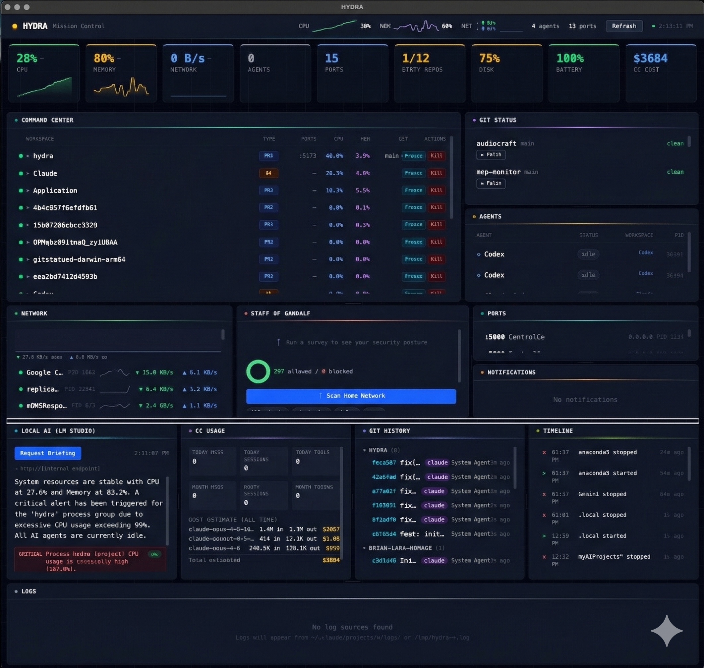

# HYDRA — AI-Native Mission Control

> htop meets aircraft carrier CIC meets AI briefing officer

A desktop app for developers monitoring local machines — processes, AI agents, git repos, network, security — with an AI intelligence layer powered by Claude.



## Features

HYDRA provides 14 integrated monitoring and intelligence systems:

| System                 | Description                                                                |
| ---------------------- | -------------------------------------------------------------------------- |
| **Process Monitoring** | Smart process grouping by project, agent, and service via `ps aux` parsing |
| **Port Monitoring**    | Listening port detection and port-to-process mapping via `lsof`            |
| **AI Agent Detection** | Automatic detection of Claude Code, Codex, and Gemini agents               |
| **Git Status**         | Multi-repo branch tracking, dirty state, ahead/behind counts               |
| **Network Bandwidth**  | Per-process bandwidth monitoring with rate computation via `nettop`        |
| **Firewall Rules**     | LuLu firewall rule parsing — allow/block correlation per process           |
| **Log Tailing**        | Live log file streaming with file watcher                                  |
| **AI Briefing**        | On-demand Claude Haiku briefings of system state (Cmd+B)                   |
| **Auto-Heal Engine**   | Rule-based self-healing with 60s cooldowns (5 built-in rules)              |
| **Security Scans**     | Staff of Gandalf integration (survey, illuminate, shadowfax, delve, scry)  |
| **Dashboard UI**       | 9 panels with dark theme and neon accents                                  |
| **Scorecards Strip**   | 6 at-a-glance health cards with big numbers and trends                     |
| **Time-Series Charts** | Ring buffer (60 snapshots, ~2min history) with SVG sparklines              |
| **System Tray**        | Color-coded health indicator in the menu bar                               |

## Prerequisites

- **Node.js** 18+
- **macOS** (required for full functionality — `nettop`, `lsof`, LuLu firewall monitoring)
- **ANTHROPIC_API_KEY** environment variable (optional, for AI briefings)

## Quick Start

```bash
git clone https://github.com/kunalnano/hydra.git
cd hydra
npm install
npm run dev
```

## Build

```bash
# Production build
npm run build

# Package for macOS (.dmg)
npm run build:mac

# Package for Linux (.AppImage)
npm run build:linux
```

## Configuration

### Environment Variables

| Variable            | Required | Description                                                                           |
| ------------------- | -------- | ------------------------------------------------------------------------------------- |
| `ANTHROPIC_API_KEY` | No       | Enables AI briefings via Claude Haiku. Without it, briefings show a "no key" message. |

### Config File

HYDRA stores configuration at `~/.config/hydra/config.json`. This includes:

- Monitored git repository paths
- Auto-heal rule preferences
- Panel layout and collapse state

## Architecture

HYDRA follows a strict Electron main/renderer split:

- **Main process** (`src/main/`) — System monitors run on a 2s interval, collecting data via CLI parsing. The intelligence layer provides AI briefings and auto-heal rules.
- **Preload** (`src/preload/`) — Typed IPC bridge via `contextBridge`. All channels defined in `shared/types.ts`.
- **Renderer** (`src/renderer/`) — React 18 dashboard with Zustand stores. 9 panels, 4 pure SVG chart components.
- **Shared** (`src/shared/`) — TypeScript interfaces shared across all processes.

See [CLAUDE.md](CLAUDE.md) for full architectural details, coding conventions, and the complete file map.

## Tech Stack

- **Electron 28** — Desktop runtime
- **React 18** — UI framework
- **TypeScript** — Type safety across all processes
- **Tailwind 4** — Utility-first styling
- **Zustand** — State management (system store + timeseries ring buffer + UI store)
- **Vite** — Build tooling via electron-vite
- **Vitest** — Testing framework
- **SQLite** — Local persistence for history and trends (via better-sqlite3)

## Testing

```bash
# Run all tests
npx vitest --run

# Watch mode
npx vitest --watch
```

Tests cover all monitor parsers with edge cases: empty output, malformed data, header-only input. Rate computation tests use a two-snapshot pattern. All parsers are pure functions — no mocking needed.

## Contributing

1. Fork the repository
2. Create a feature branch (`git checkout -b feature/my-feature`)
3. Make your changes and add tests
4. Run the test suite (`npx vitest --run`)
5. Commit with conventional messages (`feat:`, `fix:`, `docs:`, `refactor:`)
6. Open a Pull Request

## License

[MIT](LICENSE) — Copyright (c) 2024-2025 HYDRA Contributors
