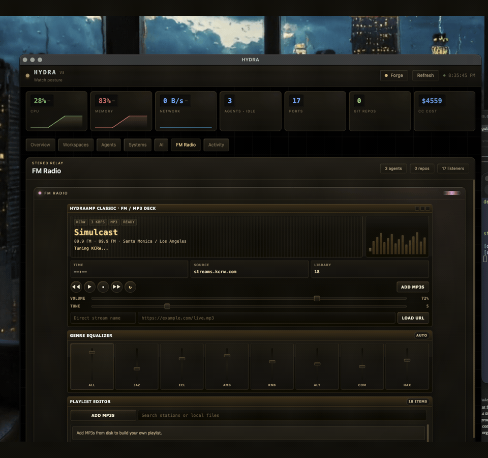
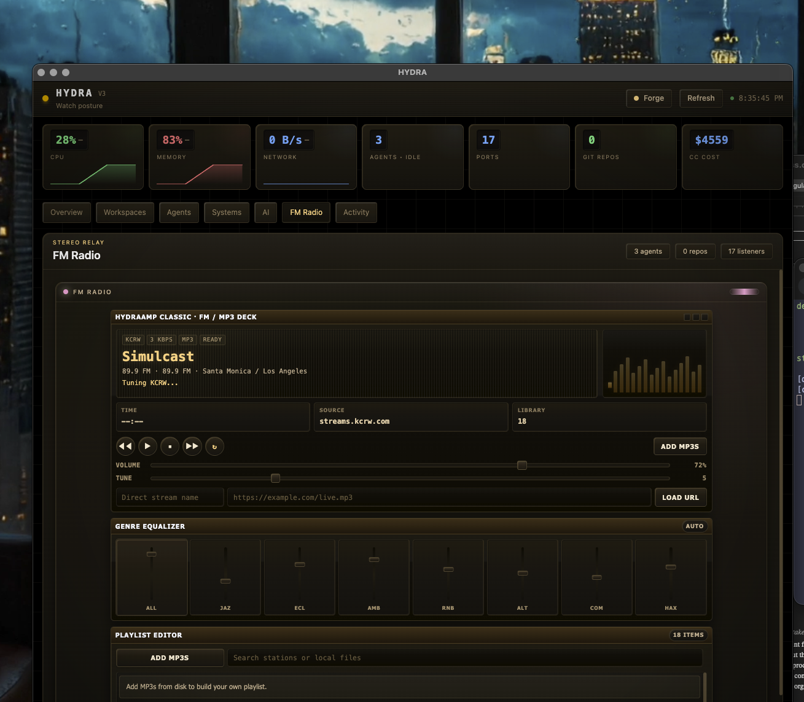
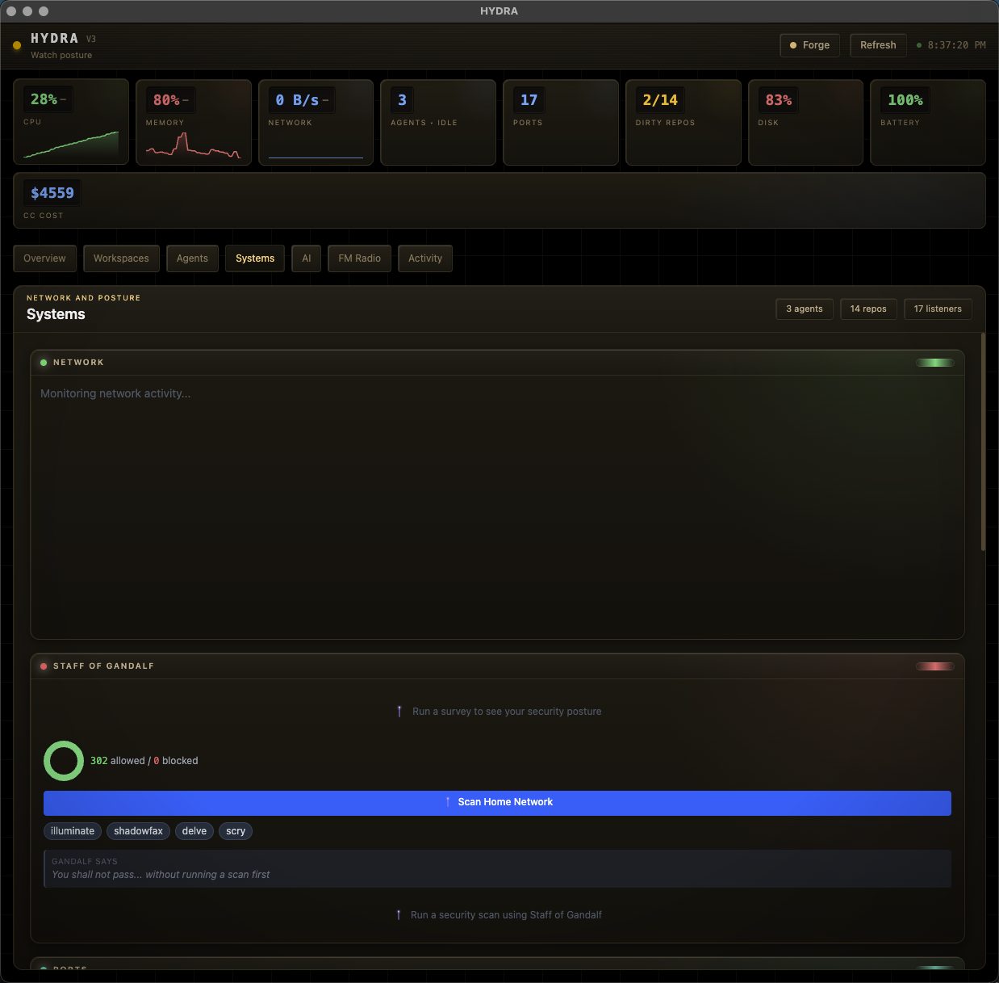

# HYDRA v3.1.0 — Operator Shell For Local AI Systems

Hydra is a desktop ops shell for developers running AI agents, local services, and multi-machine model workflows. It keeps overall system status visible while giving each domain its own page instead of forcing everything into one dense dashboard.

Latest release: `v3.1.0`

Version 3.1.0 pushes the shell further into a tighter retro-control-room direction, adds a dedicated Winamp-style `FM Radio` deck with a built-in relay and local MP3 loading, and continues Hydra's PolyForm Noncommercial release line. Earlier releases through `v2.1.2` remain under the terms they originally shipped with.





Operator walkthrough: [docs/OPERATOR-WALKTHROUGH.md](docs/OPERATOR-WALKTHROUGH.md)

## See The Shell

### Overview

The overview screen is Hydra's calmer control layer: persistent scorecards across the top, a dedicated left-hand navigation rail, and page-level drill-down instead of one giant cockpit trying to shout every metric at once.

- Persistent scorecards keep CPU, memory, ports, repo drift, battery, and Claude Code cost visible at all times
- The navigation rail gives each operating surface its own home: `Overview`, `Workspaces`, `Agents`, `Systems`, `AI`, `FM Radio`, and `Activity`
- The shell is built so you can move from "something looks off" to the exact page that can act on it without losing context
- `Deck`, `Orbiter`, and `Forge` give the shell three coherent skins instead of a one-off theme toggle

### AI Page

The AI page is now intentionally singular: the Live Lattice gets the full runway, the interface tray sits directly beneath it, and the page stays focused on the local model loop instead of repeating panels that already live elsewhere in the shell.

- The Live Lattice maps real workstation entities to the globe: `Workspaces`, `Agents`, `Ports`, and `Git` each get their own node color
- The labeled legend makes the color story readable instead of leaving you to guess what the dots mean
- `Request Briefing`, `Invoke Repair`, and `Invoke Yennefer` stay attached to the visualizer so the page behaves like an instrument, not just a decoration
- The LM Studio endpoint, lens control, live swarm metrics, and readout now live in the interface tray beneath the globe instead of squeezing the lattice sideways

## Navigation Flow

Hydra's biggest shell shift is structural, not cosmetic. The app now behaves like a shell with purpose-built pages instead of a single overstuffed dashboard.

- `Overview` answers what changed and what needs attention now
- `Workspaces` handles repo drift, process orchestration, and command-center sorting
- `Agents` focuses on live agent state and swarm load without dragging in unrelated infrastructure noise
- `Systems` keeps ports, network, security, and CC usage together
- `AI` gives the operator-facing local model loop its own space, anchored by the Live Lattice visualizer
- `FM Radio` adds a lightweight live-stream tuner with station presets and manual stream loading
- `Activity` isolates logs, timelines, and historical movement so they stop crowding operational controls

## What Changed In v3.1.0

- Reworked the shell into a more compact machine-chrome presentation with cleaner panel hierarchy, a live skin globe, and less of the old flat dashboard framing
- Expanded the skin system to `Deck`, `Orbiter`, and `Forge`, with persisted shell-wide tokens instead of isolated one-off effects
- Rebuilt `FM Radio` as a Winamp-inspired stereo relay with presets, search, transport controls, direct stream loading, and obvious local MP3 import
- Added a main-process audio relay so presets, custom streams, and local files play through Hydra instead of depending on fragile direct renderer streaming
- Fixed Electron launch visibility and loopback media policy issues so the shell and FM deck come up reliably on the desktop

## What Landed In v2

- Dedicated pages for `Overview`, `Workspaces`, `Agents`, `Systems`, `AI`, and `Activity`
- Persistent status shell with health scorecards and always-visible system posture
- `Yennefer Lens` modes so the operator can choose `adaptive`, `creative`, or `strict` output
- Repetition-aware Yennefer prompts using recent briefing history and live workload context
- LM Studio self-heal flow that can repair stale endpoints and recover remote LAN-hosted LM Studio servers

## Core Capabilities

- **Overview page** surfaces health, hotspots, active workspaces, notifications, and the command center
- **Agents page** tracks active agent processes, cadence, and coordination load
- **Systems page** exposes ports, network traffic, platform telemetry, and security tools
- **AI page** centralizes LM Studio health, briefing requests, Yennefer invocation, and repair actions
- **FM Radio page** plays public live streams with presets, search, custom URLs, and saved volume/station state
- **Activity page** keeps timeline, logs, and historical events separated from the main operational flow
- **SQLite persistence** stores snapshots, alerts, briefings, notifications, and Yennefer history locally

## Local AI Workflow

Hydra uses LM Studio as a local OpenAI-compatible endpoint. No cloud inference is required for briefings.

- Default target: `http://localhost:1234`
- Configurable via `~/.config/hydra/config.json`
- Overrideable in local development with `.env`
- `Invoke Repair` probes configured, local, and LAN-discovered endpoints and persists a repaired URL when Hydra finds a healthy LM Studio server

For cross-machine setups, enable LM Studio network serving on the host machine and make sure the chosen port is reachable through the host firewall.

## Stack

Electron 35 · React 18 · TypeScript · Tailwind 4 · Zustand · SQLite (`better-sqlite3`) · Vite (`electron-vite`) · Vitest

Electron remains the pragmatic cross-OS shell here because Hydra depends on desktop IPC, tray integration, local process inspection, filesystem access, and machine-adjacent monitoring.

## Getting Started

```bash
git clone https://github.com/kunalnano/hydra.git
cd hydra
npm install
npm run dev
```

Requires Node.js 18+.

## Configuration

Config file: `~/.config/hydra/config.json`

| Option            | Default                 | Description                                     |
| ----------------- | ----------------------- | ----------------------------------------------- |
| `lmStudioUrl`     | `http://localhost:1234` | LM Studio server URL for briefings and Yennefer |
| `yenneferStyle`   | `adaptive`              | Controls Yennefer tone and creativity           |
| `gitRepoPaths`    | `[]`                    | Paths to monitor for git status                 |
| `monitorInterval` | `2000`                  | Monitor polling interval in milliseconds        |
| `staffBinPath`    | auto-detected           | Path to the `staff` binary for security scans   |

Optional local override:

```bash
cp .env.example .env
# Example:
LM_STUDIO_URL=http://192.168.7.200:1234
```

## Testing

```bash
npm run typecheck
npm test
```

Useful targeted checks:

```bash
npm test -- yennefer briefing lmstudio
```

## Platform Support

- **macOS**: primary supported platform
- **Windows/Linux**: supported for remote LM Studio and guarded monitor paths; some local monitor integrations remain macOS-first

## License

Hydra is source-available under [PolyForm Noncommercial 1.0.0](LICENSE).

That allows personal, research, hobby, educational, and other noncommercial use,
modification, and redistribution. Commercial use is not granted by this license.

This license applies starting with `v3.0.0`. Earlier releases through `v2.1.2`
remain available under the terms they originally shipped with.
