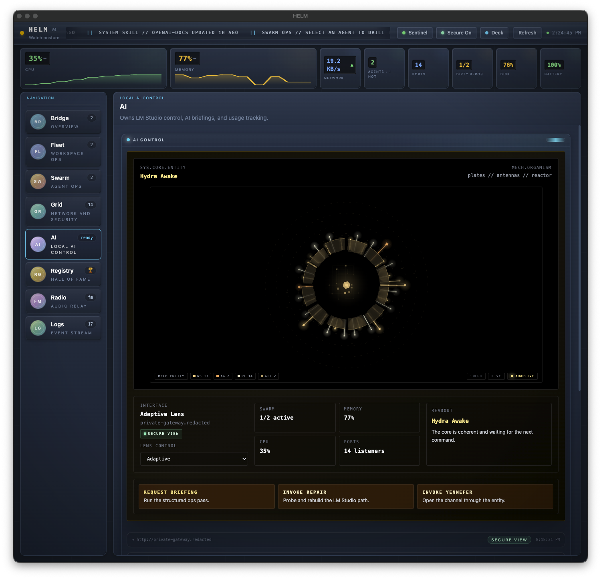
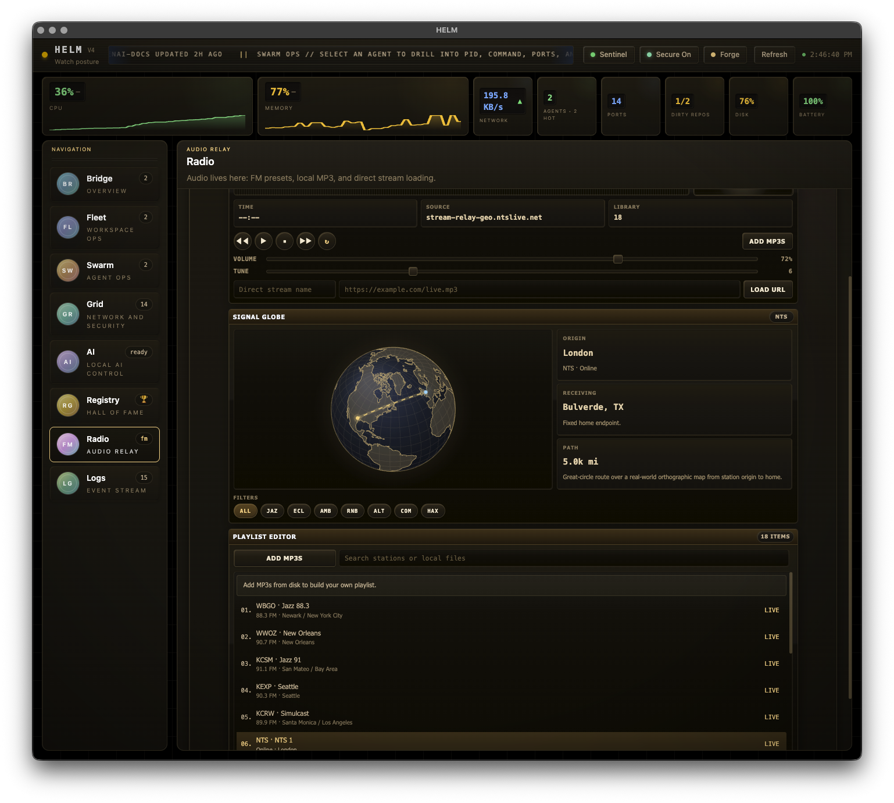
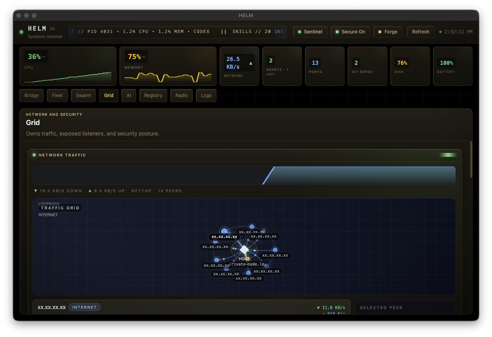

# HELM — Operator Shell For Local AI Systems

HELM is a desktop ops shell for developers running AI agents, local services, and multi-machine model workflows. It keeps overall system status visible while giving each domain its own page instead of forcing everything into one dense dashboard.

Current branch version: `4.0.2`.
Latest tagged release: `v4.0.2`.

The 4.0 line turned HELM into an operator shell with page ownership instead of panel sprawl. Recent releases added Swarm drill-down, persistent local history, a real traffic-topology grid, and a mapped radio signal globe that traces station origin back to an operator-defined home endpoint. Current mainline also carries Registry and Sentinel work targeting the next line.

> [!IMPORTANT]
> If a clean clone breaks on first run, do not edit source paths by hand.
> Fix it one of two ways:
> - Guided setup: paste [`docs/llm-setup-prompt.md`](docs/llm-setup-prompt.md) into ChatGPT, Claude, or any other LLM and follow it from the repo root.
> - Agentic repair: hand [`CLAUDE.md`](CLAUDE.md) to your coding agent, tell it to work from the repo root, copy `.env.example` to `.env`, and repair setup through config or env overrides only.

## Quick Start (2 minutes)

New here? Paste `docs/llm-setup-prompt.md` into your AI assistant for guided setup.

```bash
git clone https://github.com/kunalnano/hydra.git
cd hydra
cp .env.example .env
npm install
npm run dev
```

Requires Node.js 18+, LM Studio running locally, and at least one model loaded in LM Studio. The repo is still named `hydra`, but the desktop app window and UI are branded `HELM`.

## What's New

- Removed repo-root and machine-layout assumptions from startup by resolving `.env`, registry seed data, Sentinel config, HIVE role files, and helper scripts relative to the current clone or packaged resources
- Replaced developer-specific defaults with documented `.env` overrides for LM Studio, repo scanning, external agent feeds, log paths, Sentinel outputs, HIVE paths, and optional ElevenLabs voice settings
- Clean-clone setup now works by copying `.env.example` to `.env` from the repo root instead of editing source paths
- Renamed project from HYDRA to **HELM** across all types, CSS, config paths, and UI text
- Organized the shell around owned pages so every tab tells one story instead of repeating the same panels
- Added 4th skin: **Phantom** (deep violet neon on obsidian)
- Restored the FM signal globe as a real station-to-home world map route instead of a fake visualizer slab, then replaced the hardcoded endpoint with a saved user-defined home location
- Added a live **Traffic Grid** that turns network activity into scoped `loopback / LAN / internet` topology
- Swarm now drills into active agents with PID, command, ports, goals, and timeline context
- Local persistence now stores snapshots, alerts, briefings, notifications, and log history so the shell feels continuous
- AI ticker now surfaces local agent and skill activity instead of filler trivia
- Added the **Registry** page as a permanent historical record of built agents, plus **Sentinel** monitoring in the shell header
- Staff of Gandalf, scorecards, and network posture views were tightened so dead space stops winning

The captures below reflect the current 4.0 shell. They were taken with `Secure View` enabled so local hosts, paths, and endpoint details stay redacted.

### AI Control


### Radio Signal Map


### Traffic Grid


Operator walkthrough: [docs/OPERATOR-WALKTHROUGH.md](docs/OPERATOR-WALKTHROUGH.md)
Journey so far: [docs/wiki/journey-so-far.md](docs/wiki/journey-so-far.md)

## Navigation (8 Pages, Zero Panel Duplication)

Every panel appears on exactly one page. No duplicated widgets, no redundant noise.

| Page | What it does |
|------|-------------|
| **Bridge** | Mission control: command center, compact AI briefing, notifications |
| **Fleet** | Repo drift and process orchestration: workspaces, git status, commit history |
| **Swarm** | Agent operations: live agent state, swarm load, session timeline |
| **Grid** | Infrastructure posture: network traffic, security scans, listening ports |
| **AI** | Operator AI loop: LM Studio briefings, Yennefer, Claude Code usage tracking |
| **Registry** | Historical record: ranked agent archive, lineage, outputs, and lessons learned |
| **Radio** | FM streaming tuner with presets, local MP3 import, and direct URL loading |
| **Logs** | Live log tailing and system event stream |

## Core Capabilities

- **Bridge** surfaces health, hotspots, command center, and the compact AI briefing
- **Fleet** handles repo drift, process orchestration, git status, and commit history
- **Swarm** tracks active agent processes, cadence, coordination load, and per-agent drill-down
- **Grid** exposes ports, scoped traffic topology, and security tools
- **AI** centralizes LM Studio health, briefing requests, Yennefer invocation, and Claude Code usage tracking
- **Registry** preserves impact-ranked agent history, lineage, stacks, outputs, and lessons learned
- **Radio** plays public live streams with presets, search, custom URLs, saved volume/station state, and a mapped signal globe tied to your configured home endpoint
- **Logs** keeps live log tailing separated from operational controls
- **SQLite persistence** stores snapshots, alerts, briefings, notifications, and Yennefer history locally

## Local AI Workflow

HELM uses LM Studio as a local OpenAI-compatible endpoint. No cloud inference is required for briefings.

- Default target: `http://localhost:1234`
- Configurable via `~/.config/helm/config.json`
- Overrideable in local development with `.env`
- `Invoke Repair` probes configured, local, and LAN-discovered endpoints and persists a repaired URL when HELM finds a healthy LM Studio server

For cross-machine setups, enable LM Studio network serving on the host machine and make sure the chosen port is reachable through the host firewall.

## Stack

Electron 35 · React 18 · TypeScript · Tailwind 4 · Zustand · SQLite (`better-sqlite3`) · Vite (`electron-vite`) · Vitest

Electron remains the pragmatic cross-OS shell here because HELM depends on desktop IPC, tray integration, local process inspection, filesystem access, and machine-adjacent monitoring.

## Configuration

Config file: `~/.config/helm/config.json`

| Option            | Default                 | Description                                     |
| ----------------- | ----------------------- | ----------------------------------------------- |
| `lmStudioUrl`     | `http://localhost:1234` | LM Studio server URL for briefings and Yennefer |
| `yenneferStyle`   | `adaptive`              | Controls Yennefer tone and creativity           |
| `gitRepoPaths`    | `[]`                    | Paths to monitor for git status                 |
| `monitorInterval` | `2000`                  | Monitor polling interval in milliseconds        |
| `staffBinPath`    | auto-detected           | Path to the `staff` binary for security scans   |

Optional local override:

```bash
cp .env.example .env
# Paths in `.env` may be absolute, `~`-relative, or relative to the repo root.
# Example:
LM_STUDIO_URL=http://lm-studio-host.local:1234
HELM_GIT_REPO_PATHS=.,../shared-repos
```

## Skins

4 built-in skins, toggled with Cmd+Shift+S (Mac) / Ctrl+Shift+S:

- **Deck** - Dark gunmetal chrome, cool cyan accent
- **Orbiter** - Warmer chrome with teal-green accent
- **Forge** - Reactor gold on black, machine warmth
- **Phantom** - Deep violet neon on obsidian, night ops

## Testing

```bash
npm run typecheck
npm test
```

## Platform Support

- **macOS**: primary supported platform
- **Windows/Linux**: supported for remote LM Studio and guarded monitor paths; some local monitor integrations remain macOS-first

## License

HELM is source-available under [PolyForm Noncommercial 1.0.0](LICENSE).

That allows personal, research, hobby, educational, and other noncommercial use,
modification, and redistribution. Commercial use is not granted by this license.
